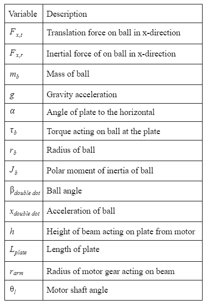
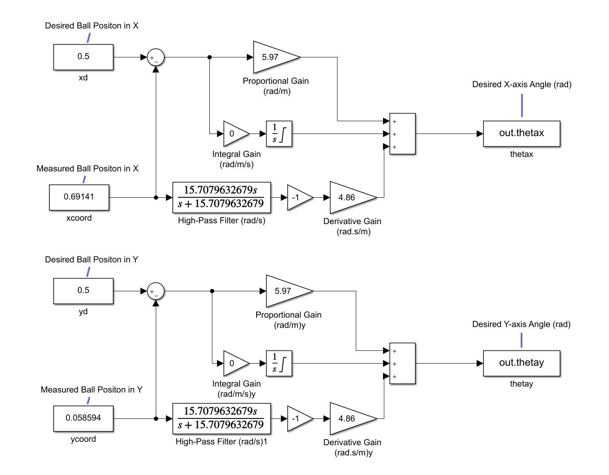
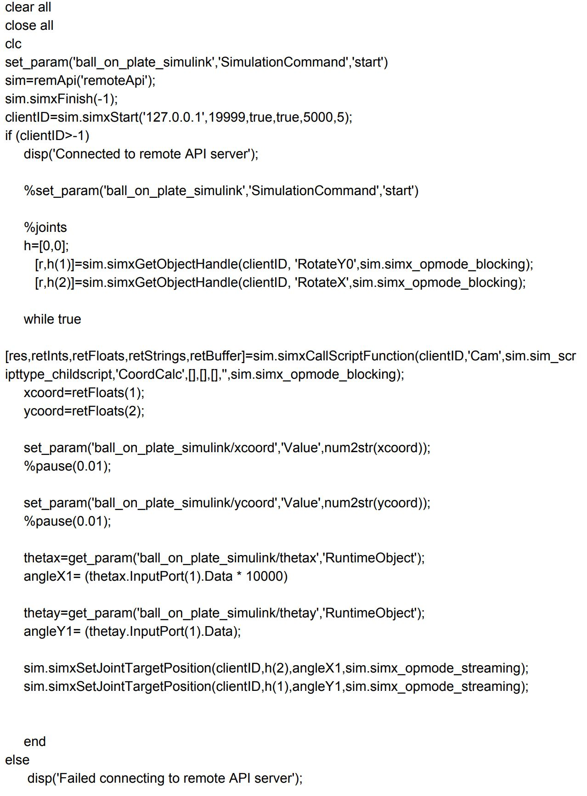
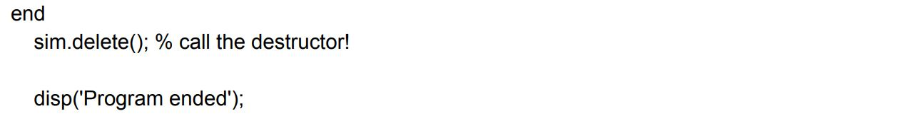

# Ball-on-Plate
-----------------------------------------------------------------------------------------
## 1. Introduction
The 2 DOF Ball Balancer or Project 2 is a system that will recognize the ball's motion on the plate and adjust its orientation to ensure that the ball is in control. MATLAB/Simulink will use a PD based control with multiple loops to control the system which will then be tested in CoppeliaSim. The system is a vision based control experiment that will communicate the balls position and two rotary servo motors will act on this to ensure that the ball will not fall off the plate.
### 1.1 Objectives
1. Create a mathematical model of the system using MATLAB/Simulink
2. Design a proportional-derivative control that will balance the ball on the plate
3. Simulate the MATLAB/Simulink control in CoppeliaSim to prove our PD control works 
4. Build a web page on GitHub that explains how the system works
### 1.2 Equipment
- 2 DOF Ball Balancer made by Quanser
- MATLAB/Simulink
- CoppeliaSim
- GitHub

## 2. Modeling
### 2.1 Background
The ball on plate project relies on a camera located above the plate to convert the balls physical location into a set of coordinates. The coordinates are then fed into Simulink where the responding servo adjustments are made to center the ball. Since a camera is used, a separate calibration program is necessary. This calibration system will establish the balancing plate as a plane with a coordinate system. This allows for data to be extracted and fed to corresponding programs. 
Without the camera calibration, any data collected would be worthless as no boundary conditions would be set. Additionally, the camera would not know what it is attempting to see. The calibration allows for color detection in which the red ball stands out on the different colored plate.
  

  
  Figure 1. One Dimensional View of the Free Body Diagram
  

Figure 1 shows the one dimensional view of the FBD of the ball and plate design. It includes a rotary servo motor that adjusts the plate to keep the ball on. The ball is allowed to move freely and the purpose of this program is to adjust and maintain stability.

  
	
  

  
### 2.2 Nonlinear Equation of Motion
Force due to gravity: 

  
  

Force cause by ball rotation:  

  
  

Where, 

  
  

Force on ball in x-direction: 

  
  

Non-linear equation of motion: 

  
  

Acceleration of the ball:

  
  

  
### 2.3 Relative Servo 
Relate motor angle to beam angle: 

  
  

Take sine of motor shaft: 

  
  

Equation of motion relating motor to ball: 

  
  

Approximation that  yields linearized equation of motion:

  
  

  
  

  Table 1. Describes the Variables Seen in the Equations Above.
  

## 3. Sensor Calibration
### 3.1 Background

  
  Figure #:
  

  
As stated before, the camera is going to relate physical motion into coordinates which will then be used to determine ball velocity. The image shown below is the coordinate system that has been established. By starting with the dimensions of the plate the plane the balls rides on is created. Two coordinate systems can then be established, one from the corner to build the boundary constraints, and the other to locate the point on the plate in which the ball will be centered on. The latter is called (Xb, Yb), and is the systems zero point.
 

  
  Figure #:
  

            
### 3.2 Camera Vision
The camera calibration program was provided for this project but a few small adjustments had to be made in order for the calibration to link with Matlab and Simulink. The figure below is the code used to calibrate the camera within Coppelia. Further adjustments would be needed if the physical system was tested as well. These variations allow for adjustability if, for instance, the physical plate size varied from that of the Coppelia simulation. 
 

  
  Figure #: Position of the Ball on the Plate Viewed by the Camera in Coordinate Form
  

  
  Figure #:
  

### 3.3 Programming
The camera cannot see the plate and grid as users will, instead the vision software identifies the ball as red and all else as the plate. With the field of view and plate dimension established, the balls location can be referenced to known dimensions. The image shown below is an example of what the camera actually sees. While the simulation is running the red dot will move within the boundaries generating various coordinates. Within the Simulink code, these can be converted into velocities to determine the balls speed by understand the rate at which images are taken. 

  
  Figure #: Coppelia Code
  

Within the main calibration program, three functions are being used. The first establishes the camera being used and allows for the coordinates to be printed internally of Coppelia. The second is just a cleanup code. While the third allows for the conversion of collected data. The final image, figure #, is the connection code which enables the coordinates to be transferred over to Matlab and Simulink.

  
  Figure #: Conection Code
  

  
## 4. Controller Design and Simulations
### 4.1 Background
	
### 4.2 Simulink Diagram

  
  Figure #: Simulink Diagram Used to Change the Angle of the Tray
  

### 4.3 Codes

  
  

  

  
  

  Here is the link to the remApi.m PDF
  
  

  

  Here is the link to the remoteApiProto.m PDF
  
  

### 4.3

## 6. Checklist
Here is the link that shows the ball balancing on the plate
https://youtu.be/dRZi4ZY73e8
